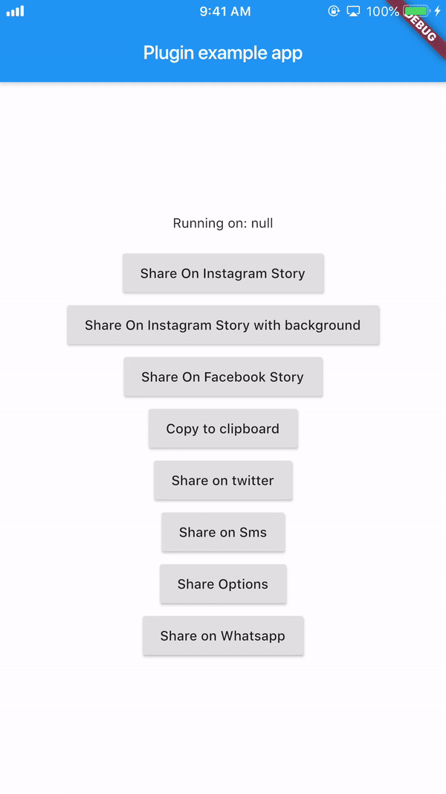
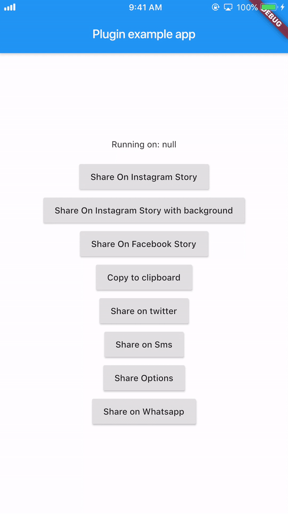

# flutter_social_share

Wide variety of sharing options you'll need to share directly to certain popular apps or just share with default native share.

## Introduction

Works on both platforms `Android` and `iOS`

Share image to twitter and sms only works on `Android`

It provides you with most of the popular sharing options
With this plugin you can share on instagram stories and facebook stories and also copy to clipboard

### iOS Configuration

#### Add this to your `Info.plist` to use share on instagram and facebook story

```
<key>LSApplicationQueriesSchemes</key>
	<array>
	<string>instagram-stories</string>
	<string>facebook-stories</string>
	<string>facebook</string>
	<string>instagram</string>
	<string>twitter</string>
	<string>whatsapp</string>
    <string>tg</string>
	</array>
```

### Add this if you are using share on facebook. For this you have to create an app on https://developers.facebook.com/ and get the App ID

```
<key>FacebookAppID</key>
<string>xxxxxxxxxxxxxxx</string>
```

#### shareInstagramStory

```
FlutterSocialShare.shareInstagramStory(imageFile.path, "#ffffff",
                              "#000000", "https://deep-link-url");
```

#### shareInstagramStorywithBackground

```
 FlutterSocialShare.shareInstagramStorywithBackground(image.path, "https://deep-link-url",
                              backgroundImagePath: backgroundimage.path);
```

#### shareFacebookStory

For iOS

```
FlutterSocialShare.shareFacebookStory(image.path,"#ffffff","#000000",
                              "https://deep-link-url","facebook-app-id");
```

For Android
appID is mandatory if using shareFacebookStory or else it wont work

```
FlutterSocialShare.shareFacebookStory(image.path,"#ffffff","#000000",
                              "https://deep-link-url","facebook-app-id",
							  appId: "xxxxxxxxxxxxx");
```

#### copyToClipboard

```
FlutterSocialShare.copyToClipboard("This is Social Share plugin");
```

#### shareTwitter

```
//with image local (only Android)
FlutterSocialShare.shareImageToTwitter(file)

//without hashtags
FlutterSocialShare.shareTwitter("This is Social Share plugin");

//with hashtags
FlutterSocialShare.shareTwitter(
                              "This is Social Share twitter example",
                              hashtags: ["hello", "world", "foo", "bar"]);

//with hashtags and link
FlutterSocialShare.shareTwitter(
                              "This is Social Share twitter example",
                              hashtags: ["hello", "world", "foo", "bar"],url:"https://your-url-here/");
```

#### shareSms

```
//without url link in message
FlutterSocialShare.shareSms("This is Social Share Sms example");

//with url link in message
FlutterSocialShare.shareSms("This is Social Share Sms example",url: "https://your-url-here/");

//with image local in message (only Android)
FlutterSocialShare.shareImageToSMS(file)
```

#### shareWhatsapp

```
FlutterSocialShare.shareWhatsapp("Hello World");
```

#### shareTelegram

```
FlutterSocialShare.shareTelegram("Hello World");
```

#### shareOptions

This will open the default native share options

```
//without an image
FlutterSocialShare.shareOptions("Hello world");

//with an image
FlutterSocialShare.shareOptions("Hello world",imagePath: image.path);
```

#### checkInstalledAppsForShare

```
FlutterSocialShare.checkInstalledAppsForShare();
```

# Here's few demo!

## Story share on Instagram



## Story share on Facebook



## Copy to Clipboard


# Known issues

On Android 6, Share to Instagram Stories may not open Instagram app or load the specified image.

# Buy me a :coffee: !!

((More coffee == more code) == more fast updates)

[](https://www.paypal.com/paypalme/quyetlathang/2)